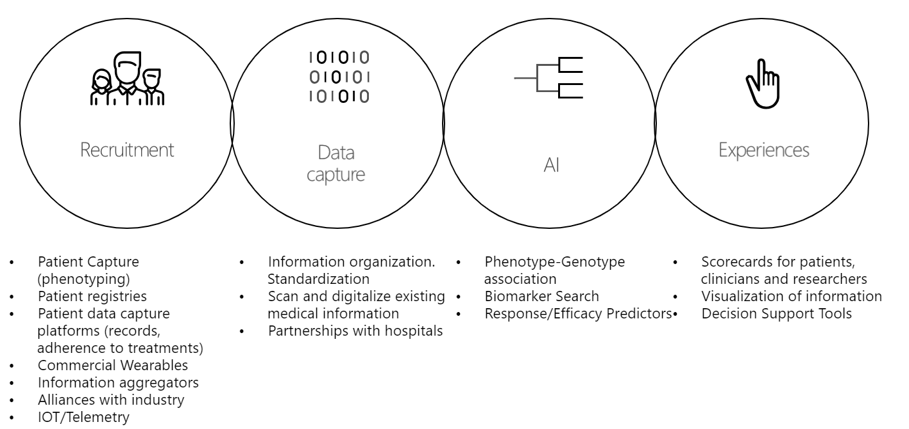

.. dx29 documentation master file, created by
   sphinx-quickstart on Tue Apr 21 16:01:32 2020.
   You can adapt this file completely to your liking, but it should at least
   contain the root `toctree` directive.

.. image:: images/All/Foundation29.png
   :width: 100px
   :align: right
   :alt: Foundation29

.. image:: images/Architecture/General_schema/H29_c4model.png

Health29
=========

**We are a technology Foundation with focus on rare diseases​**

We create health decision support systems by obtaining medical information produced by patients and physicians. We analyze that information to generate intelligence that can help make better decisions.​

This document presents a technical description of the Health29 software architecture.

.. toctree::
   :maxdepth: 2
   :caption: H29

   pages/Environments
   pages/Software architecture
   pages/SW/SystemContext
   pages/SW/Containers
   pages/SW/Components
   pages/SW/Code
   pages/Superadmin profile
   pages/Technical debt

