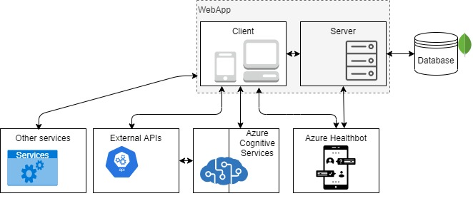

.. dx29 documentation master file, created by
   sphinx-quickstart on Tue Apr 21 16:01:32 2020.
   You can adapt this file completely to your liking, but it should at least
   contain the root `toctree` directive.
.. image:: images/All/Foundation29.png
   :width: 0px

.. image:: images/Architecture/General_schema/H29_c4model.png
   :width: 0px

.. image:: images/Architecture/Components/Webapp/Webapp.jpg
   :width: 0px

.. image:: images/Architecture/Components/Webapp/Webapp_frameworks_architecture.jpg
   :width: 0px

.. image:: images/Architecture/Code/Healthbot/Scenarios.jpg
   :width: 0px

.. image:: images/Architecture/Code/Healthbot/botflow.png
   :width: 0px

.. image:: images/Architecture/Code/Webapp/client/Client_structure.png
   :width: 0px

.. image:: images/Architecture/Code/Webapp/client/Client_structure_shared.png
   :width: 0px

.. image:: images/Architecture/Code/Webapp/client/Client_structure_src.png
   :width: 0px

.. image:: images/Architecture/Code/Webapp/server/Server_structure.png
   :width: 0px

.. image:: images/Architecture/Code/DDBB/DDBB_Division.jpg
   :width: 0px

.. image:: images/All/Foundation29.png
   :width: 100px
   :align: right
   :alt: Foundation29

Health29
=========

**We are a technology Foundation with focus on rare diseases​**

We create health decision support systems by obtaining medical information produced by patients and physicians. We analyze that information to generate intelligence that can help make better decisions.​

.. image:: images/Index/Health29_app_schema.png
   :width: 800
   :align: center
   :alt: Health29 tasks

This document presents a technical description of the Health29 software architecture.

There are four user profiles on this platform, so each one will have different associated functionalities:

- User. You can manage your profile (name, language, weight and length units), FAQs, personal information, social information, anthropometry, disease course (datapoints), medical care, medication, clinical trials, phenotype and genotype.  
- Administrator (of each patient group). You can request new language or translations and manage FAQs, request translations. In addition, you can obtain information from your patients (statistics) or send them notifications/alerts. 
- Super Administrator. This is a more technical profile. You can add languages to the platform, manage translations, and manage the different groups of patients (Add symptoms, FAQs, datapoints, medicines). 
- Clinical. You can create patients, and work on the phenotype and genotype.

.. toctree::
   :maxdepth: 2
   :caption: H29

   pages/Environments
   pages/Software architecture
   pages/SW/SystemContext
   pages/SW/Containers
   pages/SW/Components
   pages/SW/Code
   pages/Superadmin profile
   pages/Technical debt

