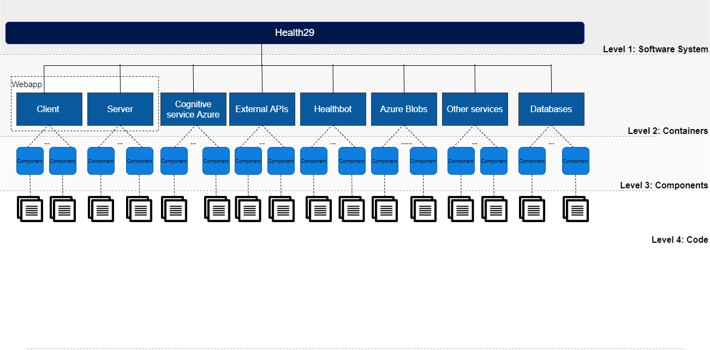

# 2. Software architecture
## 2.1. General schema

We will use the C4 model to expose the software architecture. Thus, in the description of this section we will differentiate between:

- Level 1: A **System Context** diagram provides a starting point, showing how the software system in scope fits into the world around it.
- Level 2: A **Container** diagram zooms into the software system in scope, showing the high-level technical building blocks.
- Level 3: A **Component** diagram zooms into an individual container, showing the components inside it.
- Level 4: A **code** (e.g. UML class) diagram can be used to zoom into an individual component, showing how that component is implemented.



----------------------------------------------------------------------------------------------------------------------------------
## 2.2. Level 1: System Context
************************TODO: 

For Android and iOS apps, we use the cordova framework. When compiling the Angular project, it generates the dist folder, which is the one to be added to the www folder of the Corova project.  We were evaluating ionic, nativescript and reactscript, they would be good options if we were more people, but at the moment we fit more cordova.

Our idea is to migrate to FHIR, so we would have to modify our API to make calls to [FHIR's API](https://www.hl7.org/fhir/ "Title")

Health29 provides a web API to access the data. Anyone can develop an application to access and modify the data of a Health29 user. OAuth 2.0 is used as an authorization protocol to give an API client limited access to the user's data. 

----------------------------------------------------------------------------------------------------------------------------------
## 2.3. Level 2: Containers

Health29 consists of several connected containers.
We have divided them according to their functionality and use within the platform.Thus, we will have:

- Webapp container.
- External APIs container.
- Azure cognitive services container.
- Azure healthbot container.
- Azure blobs container.
- Databases container.

<p style="text-align: center;">
	
</p>

These modules are intercommunicated using a [REST](https://restfulapi.net/) interface, that is, the communication is established according to the [HTTP protocol](https://restfulapi.net/http-methods/). 

In this way, it will be necessary to configure the different services you want to use so that communications can be established. To do this, during the implementation of the webapp the keys and the corresponding endpoint will be used to establish communication, and the sending of the REST commands will use specific authorization headers. 

The most common headers we can find are:
- Ocp-Apim-Subscription-Key. Use with Cognitive Services subscription if you pass your secret key. 
- Authorization. Use with your Cognitive Services subscription if you pass an authentication token. The value is the bearer token: Bearer token_value 

The webapp will be the core of the Health29 application, from where the frontend will be developed and the communications with different services to provide functionalities.

Health29 is a clinical history application that will allow users to enter their medical data. Different Azure services will be used to carry out the relevant actions:

- External APIs that will be used as intermediaries between the webapp and Azure's cognitive services. To add different functionalities to the application and thus simplify the development and implementation of the webapp. 
- Healthbot. The application will have a chatbot to help the user.
- Azure blobs and databases. To store information.

----------------------------------------------------------------------------------------------------------------------------------
## 2.4. Level 3: Component

Taking into account the division by containers exposed in the previous point, we are now going to study in detail the internal architecture and the components that make up each one of them.

### 2.4.1. Webapp

Health29's architecture uses a client-server software design model, so that the architecture of the webapp is like:


For the client we use the Angular 5 framework, and for the nodejs - express server, in which we have implemented an API to connect to the CosmoDb databases using mongoose for its management.


These modules are intercommunicated using a [REST](https://restfulapi.net/) interface, that is, the communication is established according to the [HTTP protocol](https://restfulapi.net/http-methods/). 

This communication between client and server is mainly used for data management, i.e. to obtain, add or modify information from databases.
For this purpose, an HTTP service will be used to allow, through requests from the client to the server, to carry out these operations. The server will listen to these requests and will perform the appropriate operations to give an answer to the client.
- Most requests to the API require an access token as authentication. For this, go to Get access_token
- Once we have the access token, we can make the calls to the api, passing the access token in the header.

All Methods APIs that have the authorization field in the header use Bearer authentication to restrict access to protected resources, , and always be sent next to a token. The bearer token is a cryptic string, generated by the server in response to a login request. Example of the header: Authorization: Bearer "token"

These requests can return some errors, such as the token is invalid, or has expired: { status: 401, message: "Token expired"} or { status: 401, message: "Invalid Token"}

As the client is implemented using the Angular 5 framework, when compiling it ([ng build](https://angular.io/guide/deployment)) you will get a "/dist" folder that must be included in the server for the construction of the platform.

### 2.4.2. External APIs
We use two External APIs:
- *[Foundation29 API](https://f29api.northeurope.cloudapp.azure.com/index.html)*, implemented by us to use it as an intermediary between the webapp and the azure qnamaker service.
- The *[Monarch](https://api.monarchinitiative.org/) API* .

These are used for QNA and diagnostic functions for the different roles of the Health29 platform.

### 2.4.3. Azure cognitive services
#### 2.4.3.1. Computer Vision
It is used in the symptoms section. This service converts images into text in order to obtain the symptoms.

You can configure and use this azure service by following the steps in the [Microsoft guide](https://docs.microsoft.com/bs-latn-ba/azure/cognitive-services/computer-vision/). 
And access the one that uses the Health29 platform from this [link](https://portal.azure.com/#@foundation29outlook.onmicrosoft.com/resource/subscriptions/53348303-e009-4241-9ac7-a8e4465ece27/resourceGroups/health29/providers/Microsoft.CognitiveServices/accounts/recognizetexthealth29/overview).

#### 2.4.3.2. Qna maker
QnA Maker is a cloud-based Natural Language Processing (NLP) service that easily creates a natural conversation layer with the data. 

In Health29 it is used to manage the FAQs in different ways and from different points of the platform:

- To show the list of FAQs to the **users**. From the user profile you can access the FAQ page where you will be shown the results of the service consultation in the form of a list.

- So that the **administrators** of the platform can manage the list of FAQs. From the administrator profile you can add, delete and edit the list of FAQs of the service.

- It is integrated into the **healthbot** to allow users to ask questions or doubts in a more guided and personal way. 

In this case the communication of the webapp with this service is requested from the client through an external API that acts as an intermediary. However, there will also be information that will be stored in the databases, therefore, the client will also establish a communication with the server who will manage the storage of this information.

You can configure and use this azure service by following the steps in the [Microsoft guide](https://docs.microsoft.com/en-us/azure/cognitive-services/qnamaker/).
And access the one that uses the Health29 platform from this [link](https://portal.azure.com/#@foundation29outlook.onmicrosoft.com/resource/subscriptions/53348303-e009-4241-9ac7-a8e4465ece27/resourceGroups/health29/providers/Microsoft.CognitiveServices/accounts/qnamakerhealth29/overview)

In particular for Health29 the following databases have been created in qnamaker: [My knowledge bases](https://www.qnamaker.ai/Home/MyServices). One would be created for each group of patients to contain their specific information and this in turn would be replicated in as many languages as the question-answer pairs are translated on the Health29 platform.


#### 2.4.3.3. Translator
This service is used to be able to make a translation of the different datapoints, to add a new language to the platform (it translates all the tags), and to translate into English the text obtained from the vision service to call the NCR service that extracts the symptoms.

You can configure and use this azure service by following the steps in the [Microsoft guide](https://docs.microsoft.com/bs-cyrl-ba/azure/cognitive-services/translator/).

And access the two that uses the Health29 platform from these links:
- [health29translateplatform](https://portal.azure.com/#@foundation29outlook.onmicrosoft.com/resource/subscriptions/53348303-e009-4241-9ac7-a8e4465ece27/resourceGroups/health29/providers/Microsoft.CognitiveServices/accounts/health29translateplatform/overview)
- [translatorBotApi](https://portal.azure.com/#@foundation29outlook.onmicrosoft.com/resource/subscriptions/53348303-e009-4241-9ac7-a8e4465ece27/resourceGroups/phenotypeBot/providers/Microsoft.CognitiveServices/accounts/translatorBotApi/overview)


### 2.4.4. Azure healthbot

Health29 has an assistant to guide the user in the use of the platform.
For this purpose, the Azure [Healthbot](https://docs.microsoft.com/en-us/healthbot/) service is used.

It guides the user through different configured scenarios where he or she can perform different actions. Initially we can divide the scenarios into three blocks:
- **New user** scenario or first time in the platform. The chatbot will provide the user with help and guidance in this process and provide he or she with more information if required.
- Scenario of **pending notifications**. In case the user has any pending notifications, he or she will be informed during the first run of the assistant.
- **Main** scenario. A series of guided scenarios will appear where the user will be able to make different types of queries.

You can configure and use this azure service by following the steps in the [Microsoft guide](https://docs.microsoft.com/en-us/healthbot/quickstart-createyourhealthcarebot). 
And access the one that uses the Health29 platform from this [link](https://portal.azure.com/#@foundation29outlook.onmicrosoft.com/resource/subscriptions/53348303-e009-4241-9ac7-a8e4465ece27/resourceGroups/testresourcesjavi/providers/Microsoft.Web/sites/HealthBotContainerSamplef666/appServices).

In particular for Health29 the following chatbots have been created (All of them use the previous App Service):
- [Healthbot](https://us.healthbot.microsoft.com/account/zebrahealthbot/scenarios/manage) of the development environment.
- [Healthbot](https://eu.healthbot.microsoft.com/account/healthbot-test-tjo3h51/scenarios/manage) of the test environment.
- [Healthbot](https://eu.healthbot.microsoft.com/account/h29bot-giochop/scenarios/manage) of the production environment.


### 2.4.5. Azure blobs
************************TODO:
-	En los blobs de azure, cada paciente tiene su blob donde se guardan pruebas médicas. 
Se hace desde el cliente

### 2.4.6. Databases
************************TODO:
(DOC health29_DBs)

----------------------------------------------------------------------------------------------------------------------------------
## 2.5. Level 4: Code
### 2.5.1. Webapp
All documentation for the Health29 application code is contained in:
- For the [development environment](https://health29-dev.azurewebsites.net/APIDOC/)
- For the [test environment](https://health29-test.azurewebsites.net/APIDOC)
- For the [production environment](https://health29.org/APIDOC/) 

#### 2.5.1.1. Communication

For establish the communication:
- The client will make requests of the type:
```
this.http.get(environment.api+'/api/'+<url>)
        .map( (res : any) => {
            // do something when res OK
         }, (err) => {
           // do something when error
         })
```

- The server will listen to these requests and will perform the appropriate operations to give an answer to the client.
```
api.get(<url>, auth, function)
```

#### 2.5.1.2. Code Structure: Client Structure

*NOTE: A template was purchased to have a base: [Template Link](https://themeforest.net/item/apex-angular-4-bootstrap-admin-template/20774875).*

The structure is as follows:

<p style="text-align: center;">
	
</p>

- The **src folder** has the following:

	

	>- app/app.component.{ts,html,css,spec.ts}: Defines the AppComponent along with an HTML template, CSS stylesheet, and a unit test. It is the root component of what will become a tree of nested components as the application evolves. In this file it is controlling the events of inactivity of a session, loading the language of the app depending on the language of the browser, the title that appears in the browser tab with the change of pages. If it is a mobile app, it also controls the backbutton, pause and resume events.
	>- app/app.module.ts: Defines AppModule, the root module that tells Angular how to assemble the application. 
	>- assets/..: It contains all the information that will be accessible from any url. Css files, js, images, language files, jsons listing countries, types of subscriptions, frequently asked questions for each group of patients, etc. It will be the only visible folder when a build is made for production.
	>- environments/..: This folder contains one file for each of your destination environments, each exporting simple configuration variables to use in your application. The files are replaced on-the-fly when you build your app. You might use a different API endpoint for development than you do for production or maybe different analytics tokens. You might even use some mock services. Either way, the CLI has you covered. At the moment url of the api, and fitbit credentials
	>- favicon.ico: Every site wants to look good on the bookmark bar. Get started with your very own Angular icon
	>- index.html: The main HTML page that is served when someone visits your site. Most of the time you'll never need to edit it. The CLI automatically adds all js and css files when building your app so you never need to add any script or link tags here manually. For the mobile version, two small changes must be made in this file:
		Change base: base href="./"
		Add cordova:  "script src="cordova.js"
	>- main.ts: The main entry point for your app. Compiles the application with the JIT compiler and bootstraps the application's root module (AppModule) to run in the browser. You can also use the AOT compiler without changing any code by passing in --aot to ng build or ng serve
	>- polyfills.ts: Different browsers have different levels of support of the web standards. Polyfills help normalize those differences. You should be pretty safe with core-js and zone.js, but be sure to check out the Browser Support guide for more information.
	>- styles.css: Your global styles go here. Most of the time you'll want to have local styles in your components for easier maintenance, but styles that affect all of your app need to be in a central place.
	>- test.ts: This is the main entry point for your unit tests. It has some custom configuration that might be unfamiliar, but it's not something you'll need to edit.
	>- tsconfig.{app|spec}.json: TypeScript compiler configuration for the Angular app (tsconfig.app.json) and for the unit tests (tsconfig.spec.json).


- The **app folder** is the one with all the code:
	>- Layouts: the different layouts that there are, at the moment two subfolders, for the logged ones (full) and for the ones that are not (content).
	>- Pages: It has two subfolders, content-pages (corresponds to the logged out pages like login page, registration, etc) and full-pages (common pages for all logged out roles, like the user-profile page).
	>- admin: contains all pages for the admin role
	>- superadmin: contains all pages for the superadmin role
	>- user: contains all the pages for the user role. 
	Each folder of these roles has a module file (it loads the needed modules), and a route file to manage the routes and control the authentication and authorization (auth-guard and role-guard)

- The **shared folder**, which is the shared code:

	

	>- auth: authorization management (role-guard), authentication (auth-service and auth-guard), http interceptor, oauth.services for external services like fitbit.
	>- Configs: configuration files, for example configuration for toasts, or parameters for graphs. 
	>- Customizer: right side slide (not used at the moment)
	>- Directives: correspond to the angle directives
	>- Footer: app footer
	>- Models: data models
	>- Navbar and navbar-nolog: It corresponds to the top bar. Navbar-nolog is for when you are not logged in.
	>- Routes: route management. It has two files, one for the paths of the unlogged pages, and another for the rest. 
	>- Services: corresponds to the angle services. Several have been developed as faq.service or lang.service
	>- Sidebar: side menu, depending on the role, loads one menu or another.  

- **Routes**: In the root of the app folder, there is a file called app-routing.module.ts, which is the root of the routes management. Depending on the path, it loads some subroutes and others. For example, if it is unlogged, it loads the routes ./shared/routes/content-layout.routes, on the other hand, if it is logged in it loads ./shared/routes/full-layout.routes. In this second case, check that it is authenticated (canActivate: [AuthGuard])
The rest of the subroutes that come from full-layout, are controlled if they are logged and authenticated in the routing-module file of each module (each profile has a module) with canActivate: [AuthGuard, RoleGuard].


#### 2.5.1.3. Code Structure: Server Structure

<p style="text-align: center;">
	
</p>

- index.js: file where the app.js and config.js file is loaded It listens to requests.
- Config.js: configuration file. The server url, port, connection with the data bases are passed to it through environment variables. The credentials of the mail that send email, the secret token of jwt, and the secret of crypto are not passed through environment variables.
- Db_connect.js: will be in charge of creating the connection with the databases.
- App.js: the crossdomain is established, and other node configurations. It manages the requests, and these can be of 3 types: 
	>1. API routes managed by routes folder. 
	>2. Server-generated view paths (handlebars)
	>3. the paths of the Angular client application (dist folder)

#### 2.5.1.4. Build
By running ng build --prod we minimize and compress the code. This command will create a new folder called dist, and it will have the project optimized. This dist folder will be the one uploaded to the root of the node server that manages the API. It will also be used to create the mobile apps, adding it to the www folder of the cordoba project. 

#### 2.5.1.5. Deploy environments
Each environment has been created as an independent project, so in order to move from one environment to another you will have to copy the code of one over the new one. 
In this process it must be taken into account that the environment.prod file in the environments folder has been previously configured for each environment, and therefore it is different in each one of them. Before making any changes you must ensure that it is kept in the environment to be updated and that during the process of copying code from one environment to another the information in this file is not modified. 

#### 2.5.1.6. External libraries and dependencies
************************TODO: LIBRERIAS Y DEPENDENCIAS!!!

### 2.5.2. External APIs
API Foundation29 has been designed to act as an intermediary between the webapp and Azure Qnamaker's service.
The functions that have been implemented to perform actions on the Azure service are analogous to those in the [Azure documentation](https://docs.microsoft.com/en-us/azure/cognitive-services/qnamaker/quickstarts/quickstart-rest-curl).

It can be consulted at the following link: [API Foundation29](https://f29api.northeurope.cloudapp.azure.com/index.html).
And the functionality and methodology of use is described in the qnamaker section of this document (2.5.3.2. Qna maker)

Some functions to use the monarch API from this have also been included in this API. But this is not being used at the moment in health29 and the calls to the monarch API are executed directly, without intermediaries.

Todavía no tenemos desplegado todo lo de monarch, por ello aún hacemos alguna petición a sus servicios,  para obtener la lista de condiciones relacionadas:

- Request for list of related conditions
```
request({
url: https://api.monarchinitiative.org/api/sim/search?is_feature_set=true&metric=phenodigm&id=HP:0001250&id=HP:0002133&limit=100&taxon=9606’,
json: true
}
```
- To open a new link for information on a symptom
```
href="https://monarchinitiative.org/phenotype/'+res[j].id+'
```

- To obtain information about a disease:
```
href=”https://monarchinitiative.org/disease/{{value.id}}#overview 
```

### 2.5.3. Azure cognitive services
#### 2.5.3.1. Computer Vision
To create it from azure you just have to select the cognitive service in the marketplace: "ComputerVision".
The configuration has no complexity, just select the Price tier and the resource group.

It is used in the webapp client, as it has been indicated until now, establishing a REST communication:
```
this.subscription.add( this.http.post('https://westeurope.api.cognitive.microsoft.com/vision/v1.0/ocr?language='+this.cognitiveServicesLanguage +'&detectOrientation=true', data)
    .subscribe( (res : any) => {
    	// Do something when result OK
	}, (err) => {
     // Do something when error
}));
```
And the configuration of the headers (auth.interceptor.ts) to use this service is:
```
if(req.url.indexOf('api.cognitive.microsoft.com/vision')!==-1){
  isExternalReq = true;
  const headers = new HttpHeaders({
    'Ocp-Apim-Subscription-Key': '992ab4c1c5ff4412a052b0d170feeab8',
    'Content-Type': 'application/octet-stream'
  });
  authReq = req.clone({ headers});//'Content-Type',  'application/json'
}
```
As it has been said before this is used for the symptom extraction, so the call is made in phenotypes.component.ts.

All the commands and settings for establishing this communication are described in the [Microsoft documentation](https://docs.microsoft.com/bs-latn-ba/azure/cognitive-services/computer-vision/vision-api-how-to-topics/howtocallvisionapi).

#### 2.5.3.2. Qna maker
To create it from azure you just have to select the cognitive service in the marketplace: "Qna maker".
The configuration has no complexity, just:
- Enter a name
- Select subscription of Azure, the Price tier, the resource group adn the localization.
- Enter an application name for establish the url: "app_name.azurewebsites.net"

As previously stated, in Health29 it is used to manage the FAQs in different ways and from different points of the platform. To work with the data of this azure service, an external API will be used as an intermediary: f29API, described in the previous section, so that all calls will be made to it. However, the same format has been used as if the calls were made directly to Azure's service, as an example:
```
this.http.get('https://f29api.northeurope.cloudapp.azure.com/api/knowledgebases/'+knowledgeBaseID+'/Prod/qna')
    .map( (res : any) => {
      // Do something when get the Knoledbase information
	}, (err) => {
     // Do something when error
}));
```
And with the configuration of the headers (auth.interceptor.ts) to use this service the same thing happens, the ones that would be necessary to establish the connection with Azure's service are sent:
```
if(req.url.indexOf('https://f29api.northeurope.cloudapp.azure.com')!==-1){
  isExternalReq = true;
  const headers = new HttpHeaders({
    'Ocp-Apim-Subscription-Key': '8d7bca89da4e42c1bf79b292207c9635'
  });
  authReq = req.clone({ headers});
}
```
 
All the commands and settings for establishing this communication are described in the [Microsoft documentation](https://docs.microsoft.com/en-us/azure/cognitive-services/qnamaker/quickstarts/quickstart-rest-curl).

#### 2.5.3.3. Translator
To create it from azure you just have to select the cognitive service in the marketplace: "Translator text".
The configuration has no complexity, just select the Price tier and the resource group.

It is used in the webapp client, as it has been indicated until now, establishing a REST communication:
- First case: communication without authorization required.
```
this.subscription.add( this.http.post('https://api.cognitive.microsofttranslator.com/translate?api-version=3.0&to='+this.authService.getLang(), jsonText)
    .subscribe( (res : any) => {
    	// Do something when it returns the text from jsonText translated
    }, (err) => {
       // Do something when error
    }));
```
- Second case: communication with authorization required.

```
this.subscription.add( this.http.post('https://api.cognitive.microsoft.com/sts/v1.0/issueToken','')
    .subscribe( (res : any) => {
      	// get the token for establish communication between webapp and text translator
        sessionStorage.setItem('tokenMicrosoftTranslator', res);
	}, (err) => {
	 	// Do something when error
	}));
```
```
this.subscription.add( this.http.get('https://api.microsofttranslator.com/V2/Http.svc/Translate?appid=Bearer' + ' ' + sessionStorage.getItem('tokenMicrosoftTranslator')+'&text='+<text>+'&to=en&Authorization=Bearer' + ' ' + sessionStorage.getItem('tokenMicrosoftTranslator'))
	.subscribe( (res : any) => {
		// Do something when it returns the text from <text> translated
	}, (err) => {
	 	// Do something when error
	}));
```


And the configuration of the headers (auth.interceptor.ts) to use this service is:
```
if(req.url.indexOf('https://api.cognitive.microsoft.com/sts/v1.0/issueToken')!==-1){
  isExternalReq = true;
  authReq = req.clone({ headers: req.headers.set('Ocp-Apim-Subscription-Key',  '7174b790ef59409280f77dd94c34a9d2' ), responseType: 'text'});
}

if(req.url.indexOf('https://api.microsofttranslator.com')!==-1){
  isExternalReq = true;
  authReq = req.clone({ responseType: 'text' });
}
if(req.url.indexOf('https://api.cognitive.microsofttranslator.com')!==-1){
  isExternalReq = true;
  authReq = req.clone({ headers: req.headers.set('Ocp-Apim-Subscription-Key',  '7174b790ef59409280f77dd94c34a9d2' ) });
}
```

The first of these is used to translate the datapoints and to add a new language to the platform, while the second is used in the symptom section (phenotype) to translate into English the text obtained from the vision service.

All the commands and settings for establishing this communication are described in the [Microsoft documentation](https://docs.microsoft.com/bs-cyrl-ba/azure/cognitive-services/translator/).

### 2.5.4. Azure Healthbot
To create it from azure you just have to select the cognitive service in the marketplace: "Healthcare Bot".
To create and configure it, just follow the steps in the [Microsoft guide](https://docs.microsoft.com/en-us/healthbot/quickstart-createyourhealthcarebot).

In the case of Health29, the App service [server](https://healthbotcontainersamplef666.scm.azurewebsites.net/dev/wwwroot/server.js) has been configured to be able to deploy the three bots depending on the webapp client that is running it. So that:
```
var WEBCHAT_SECRET = process.env.WEBCHAT_SECRET;
var APP_SECRET = process.env.APP_SECRET;
if(req.headers.origin == 'https://health29.org'){
    
}else if(req.headers.origin == 'https://health29-test.azurewebsites.net'){
    WEBCHAT_SECRET = process.env.WEBCHAT_SECRET_TEST;
    APP_SECRET = process.env.APP_SECRET_TEST;
}else if(req.headers.origin == 'http://localhost:4200' || req.headers.origin =='https://health29-dev.azurewebsites.net'){
    WEBCHAT_SECRET = process.env.WEBCHAT_SECRET_DEV;
    APP_SECRET = process.env.APP_SECRET_DEV;
}
```
It should be noted that this service has a monthly message limit. Depending on the rate chosen in each of the Healthbots, a greater or lesser flow of information exchange or interactions of the Health29 assistant will be allowed. 

*NOTE: if at any time the limit is exceeded, the bot will return error 429 (Too many request).*

The incorporation of this assistant to the webapp is done from the client, in particular, from the customizer component.

(Meter imagen https://docs.microsoft.com/en-us/healthbot/integrations/embed)

This way, it is added to the HTML:
```
<div id="botContainer" style="width:95%"></div>
```
And the style is added from the scss file.

As for the functionality of the bot, this is included in the ".ts" file, taking into account:

( Meter imagen: https://docs.microsoft.com/en-us/healthbot/integrations/embed)

So, the steps to follow are:

1. Get the token for the connection with the azure service:
```
var paramssend = { userName: this.user.userName, userId: this.authService.getIdUser(), token: this.authService.getToken(), groupId: this.groupId, lang: this.user.lang, knowledgeBaseID: this.knowledgeBaseID}; 
this.subscription.add( this.http.get('https://healthbotcontainersamplef666.azurewebsites.net:443/chatBot',{params: paramssend})
	.subscribe( (res : any) => {
		// Get the token OK
	}, (err) => {
		// Get the token Error
}));

```
2. Create a bot connection:
```
const jsonWebToken = token;
const tokenPayload = JSON.parse(atob(jsonWebToken.split('.')[1]));
const user = {
  id: tokenPayload.userId,
  name: tokenPayload.userName
};
const botConnection = new BotChat.DirectLine({
  //secret: botSecret,
  token: tokenPayload.connectorToken,
  //domain: "",
  webSocket: true
});
```
3. Start conversation
```
const botContainer = document.getElementById('botContainer');
$('#botContainer').empty();
botContainer.classList.add("wc-display");   
BotChat.App({
    botConnection: botConnection,
    user: user,
    locale: this.user.lang,
    bot: {id: ''},//id: 'h29bot-giochop' //id: 'zebrahealthbot'
    resize: 'detect'
    // sendTyping: true,    // defaults to false. set to true to send 'typing' activities to bot (and other users) when user is typing
}, botContainer);
```
4. A communication will be established with it to exchange information and perform the relevant actions:
```
this.subscription.add( botConnection.postActivity({type: "event", value: jsonWebToken, from: user, name: "InitAuthenticatedConversation"}).subscribe(function (id) {
     // Start scenarios
}, (err) => {
		// Do something when error
}));
```
All the commands and settings for using this Healthbot service ara available in [Microsoft documentation](https://docs.microsoft.com/en-us/healthbot/integrations/embed).

As already indicated, once the bot is embedded in the webapp you will have to indicate it to initialize the desired scenarios in each case. These scenarios are designed, implemented and configured in:

- [Healthbot](https://us.healthbot.microsoft.com/account/zebrahealthbot/scenarios/manage) of the development environment.
- [Healthbot](https://eu.healthbot.microsoft.com/account/healthbot-test-tjo3h51/scenarios/manage) of the test environment.
- [Healthbot](https://eu.healthbot.microsoft.com/account/h29bot-giochop/scenarios/manage) of the production environment.

In the microsoft documentation there are [guides](https://docs.microsoft.com/en-us/healthbot/quickstart-createyourfirstscenario) to help you create these scenarios.

************************TODO:

(ESQUEMA ACTUAL DE CONEXION DE ESCENARIOS DE H29)

(Explicar que ahora mismo se triplica cada escenario de acuerdo con el idioma del usuario de H29, a futuro habría que modificar todo para utilziar la localizacion del bot para conseguir estas traducciones pero en ese caso tener en cuenta que tambien tienen 
que traducirse los mensajes de error que manda el bot "Oops..." que estan contemplados en la app H29 ahora mismo: se tratan desde la aplicacion y se modifica el texto para el idioma correspondiente)

### 2.5.5. Azure blobs
************************TODO:
### 2.5.6. Databases
************************TODO:

